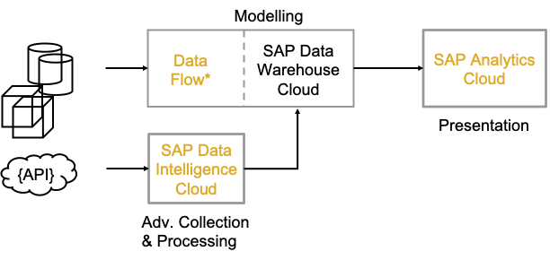
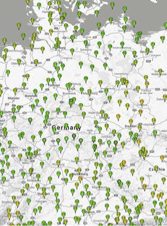

# DAT 160 - Create and manage Data Flows using SAP Data Intelligence

## Description

This repository contains the material for the SAP TechEd 2021 session <b>DAT160 - Create and manage Data Flows using SAP Data Intelligence</b>.

## Overview

This session introduces attendees to build and end-to-end scenario from 

* collecting external data of unusual format with SAP Data Intelligence,
* process the data with a complex algorithm with SAP Data Intelligence
* merge the data from different data source in SAP Data Warehouse Cloud with Data Flow (=embedded SAP Data Intelligence)
* add some additional modeling with SAP Data Warehouse Cloud and prepare it for eventually
* using SAP Analytics Cloud to visualize a final consolidated result set containing all relevant external data assets described in the first point from above

### User Case

The company **SenDi** is running devices distributed across Germany. They assume that the repair services of the devices might depend on the weather conditions and the product type. Before they start into a deeper analysis with a data scientist they like to visualize the weather conditions impact on the service frequency of product types to detect any obvious correlation. 

They first want to start in Germany where they have 1000 devices of 7 product types scattered accross the whole country and there is net of 377 weather stations that provide data. 

Fortunately in a former project **SenDi** has already developed 2 pipelines with SAP Data Intelligence that 

1. Downloads on a monthly basis the weather stations
2. Downloads on weekly basis the weather stations

What needs to be done, is to map each device to the nearest weather station. For this read the data sources of all devices and the list of weather stations and use a "next-neighbour"-algorithm encapsulated in a ready-to-use custom operator **next neighbour**. 

Subsequently we like to collect further data as the 

* **services** table containing the repair services SenDi had to do for the devices and 
* past **weather data** measured near to the devices. 

Finally we like to merge all data into one data model leveraging the **Data Flow Builder** application of SAP Data Warehouse Cloud. This component is specifically designed for Business Users that want to create re-usable data models that are consumed by analytical applications on top. Our tool of choice for building agile analytical applications is SAP Analytics Cloud which is integrated into SAP Data Warehouse Cloud up to a specific extent at least.

For the present exercise, we concentrate ourselves on deriving some insights on how the specific weather conditions **Sun Duration (in hours)** and **Percipitation Height (in cm)** are influencing the frequency of the service to be applied. This frequency is expressed via the at

### SAP Application Used

These SAP Applications are used for the exercises: 

* SAP Data Intelligence
	* Modeller
* SAP Data Warehouse Cloud
	* Data Builder (including Data Flow Builder and Graphical View Builder)
* Optional: SAP Analytics Cloud   

### Data Sources

Publicly available Data for ["Deutscher Wetterdienst"](https://www.dwd.de)

* Weather stations with geo location from Deutscher Wetter Dienst: [txt-file](https://opendata.dwd.de/climate_environment/CDC/observations_germany/climate/daily/kl/recent/KL_Tageswerte_Beschreibung_Stationen.txt)
* Measured weather data from weather stations: [Data Folder with zip-file for each weather station](https://opendata.dwd.de/climate_environment/CDC/observations_germany/climate/daily/kl/recent/)
* Hana DB table of devices	
* Hana DB table of services

## Requirements

No knowledge on both SAP Data Intelligence and SAP Data Warehouse Cloud is needed to follow this tutorial.

## Exercises

- [Getting Started](exercises/ex0/)
- [Exercise 1 - SAP Data Intelligence](exercises/ex1/)
    - [Exercise 1.1 - Review Data Collection Pipelines](exercises/ex1#exercise-11-sub-exercise-1-description)
    - [Exercise 1.2 - Create New Pipeline for Advanced Processing](exercises/ex1#exercise-12-sub-exercise-2-description)
- [Exercise 2 - Second Exercise Description](exercises/ex2/)
    - [Exercise 2.1 - Exercise 2 Sub Exercise 1 Description](exercises/ex2#exercise-21-sub-exercise-1-description)
    - [Exercise 2.2 - Exercise 2 Sub Exercise 2 Description](exercises/ex2#exercise-22-sub-exercise-2-description)

**IMPORTANT**

Your repo must contain the .reuse and LICENSES folder and the License section below. DO NOT REMOVE the section or folders/files. Also, remove all unused template assets(images, folders, etc) from the exercises folder. 

## How to obtain support

Support for the content in this repository is available during the actual time of the online session for which this content has been designed. Otherwise, you may request support via the [Issues](../../issues) tab.

## License
Copyright (c) 2021 SAP SE or an SAP affiliate company. All rights reserved. This project is licensed under the Apache Software License, version 2.0 except as noted otherwise in the [LICENSE](LICENSES/Apache-2.0.txt) file.
