# Exercise 1 - SAP Data Intelligence 

In this exercise you learn how to download data from external data sources of unusual format that needs some pre-pocessing before it is stored to a SAP Data Intelligence managed data source (Exercise 1.1). In the second Exercise you create a pipeline with a more complex processing. 

## Exercise 1.1 Review Data Collection Pipelines

This exercise explains how a complex data collection could be setup with SAP Data Intelligence. Something that you cannot do with the limited tools of DataFlow in SAP Data Warehouse Cloud.  

### Setup a HTTP Connection

1. Launch the "Connection Management"-App on Launchpad
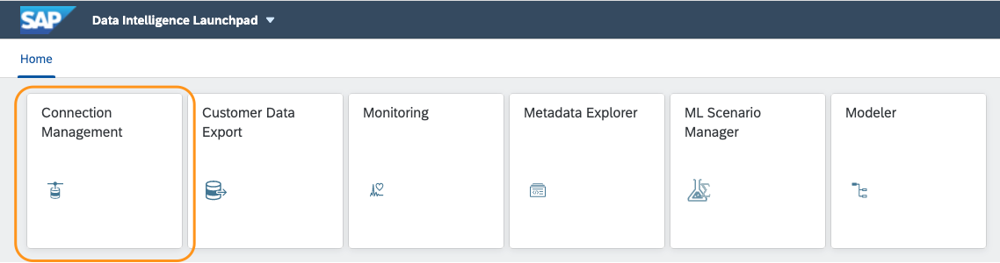
2. Open the 'Edit'-screen of the connection 'DWDStations'
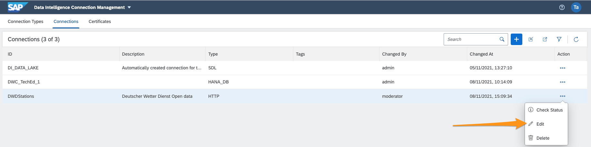
3. In the details of the connection you see that we have in addition to the "Basic details" specifications of the HTTP address:
	1. Host: opendata.dwd.de 
	2. Port: 443 (General port for downloading content)
	3. Protocol: HTTPS
	4. Path: /climate_environment/CDC/observations_germany/climate/daily/kl/recent/KL_Tageswerte_Beschreibung_Stationen.txt (path to the data we want to download)
	5. Authentication: NoAuth (because no authentication is needed)
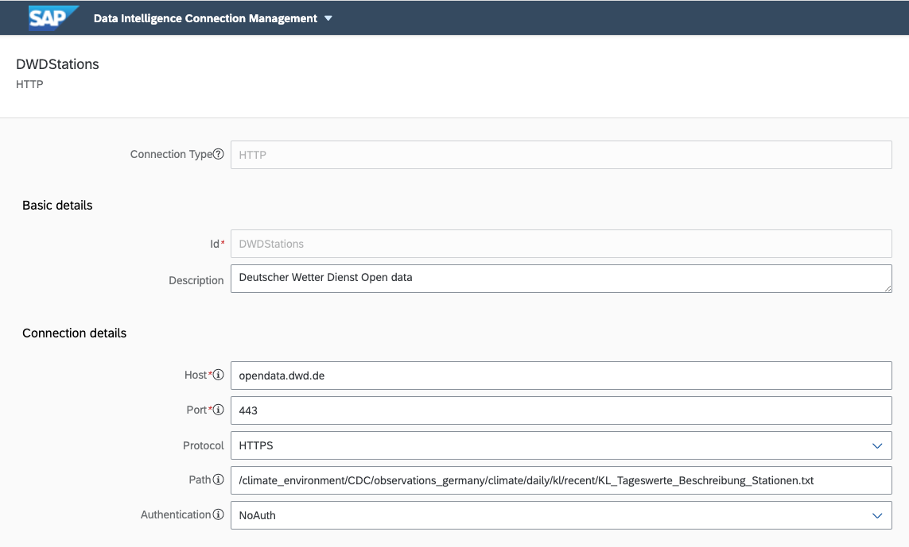
	
As you see this is pretty straightforward way of accessing external data. 

When you click on the composed URL :

[http://opendata.dwd.de/climate_environment/CDC/observations_germany/climate/daily/kl/recent/KL_Tageswerte_Beschreibung_Stationen.txt](http://opendata.dwd.de/climate_environment/CDC/observations_germany/climate/daily/kl/recent/KL_Tageswerte_Beschreibung_Stationen.txt)

you see that the format is not directly usable and you rather like to have a classic "csv"-file with English column names. 


### Pipeline Download DWD Weather Stations

In this exercise we have a look at the pipeline that 

1. uses this connection, 
2. downloads the data,
3. transforms it into "csv"-format
4. saves it to an object store.

On the "Launchpad" start the "Modeler" 

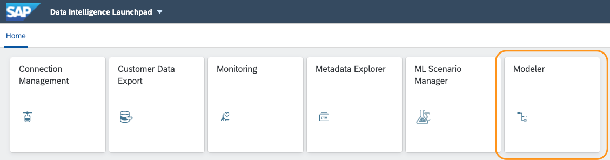

Once it has started (it can take a while because the apps is started the first time and needs to initialize the "user workspace") you can select on the left-hand panel the "graph"-category "TechEd 2021".

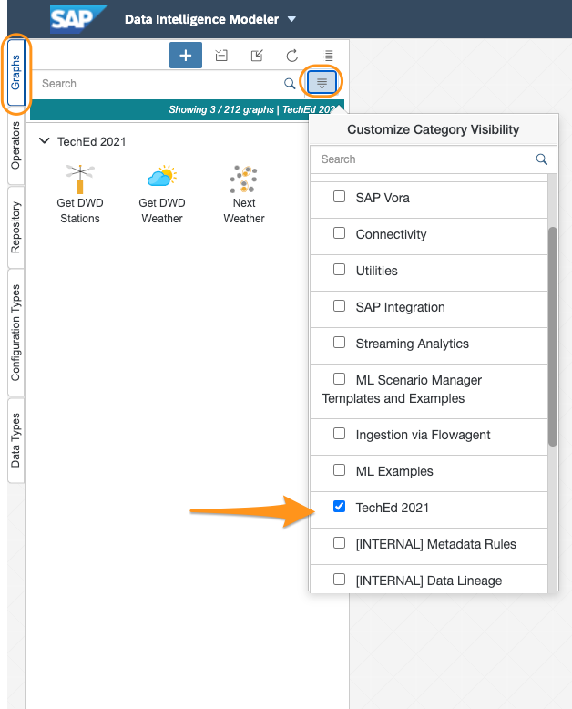

With a double click on the graph "Get DWD Stations" you can open the pipeline. 

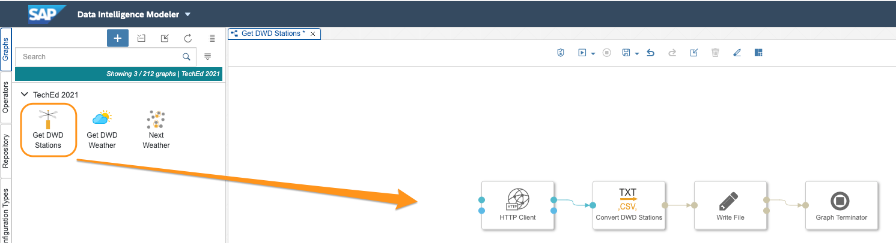.


This is basically a 3-step pipeline:

1. Get data
2. Transform data (Custom Operator)
3. Write data

The first operator "HTTP Client" is a standard opertator that uses the connection we had seen in the "Connection Management". The configuration is in the config panel you can open with the "Open Configuration" button at the operator. 


The transformation is done with a script in a custom operator. You can peek into the code by clicking the script button at the custom operator "Convert DWD Stations".

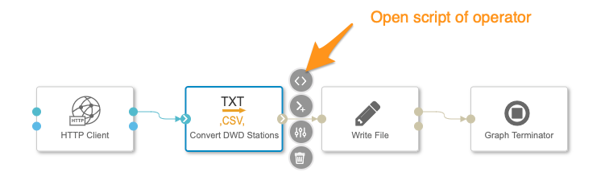.

Please be aware when you change the script in the pipeline context you branch the code from the basic custom operator script to the pipeline. That means that the script of the operator is copied to the pipeline. Further on, if the script of the custom operator is changed it will not be overtaken by the "pipeline"-custom operator script.  

The transformed data is finally stored in an object store by the "Write File"-operator. The configuration is quite self-explaining. You have to select the connection from the already define connections in the Connection Management. For more information you can read the manual of the operator.  

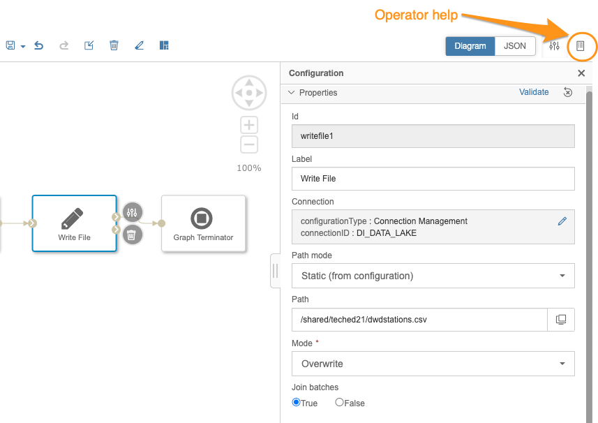.

The final operator "Graph Terminator" is completing the pipeline once it gets a signal at its inport. While the ports of most of the operators have a defined data type and you can only connect operators for which the inport and the corresponding outport have fitting data types, this operator digests all data types: 

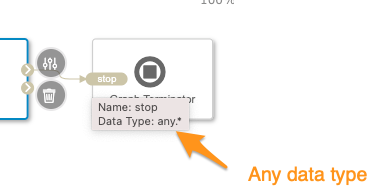.

**Please be noted,** 

that the configuration of this pipeline has not been adapted to the data sources connected with the Connection Management. The result of this pipeline has already been stored in the target database used in the following exercises. We have been told from SAP legal that getting data from public data sources in a workshop needs to be officially approved.


### Pipeline Download Weather Data 

The other pipeline is more complex that reads the weather data from the weather stations of interest (A nearby installed device). The process is 

1. Get all weather stations from a HANA table (like the one you create in the next excercise: TECHED2021DAT160#TECHED2021DAT160|TECHED2021\_DEVICES\_WEATHERSTATION\_TAXY) by an SQL-statement.
2. Creates an URL with a Custom Operator
3. Sends the created URL to the inport "inRequest" of the "HTTP Client" operator that executes the GET request. The output "zip"-file is send to a Custom Operator.
4. Unzips the downloaded data, extracts one file and transform this into a table-format.
5. Stores the data to a HANA Table: "DAILY_WEATHERDATA"
6. Decides when the data stream has come to an end and then sends a signal.
7. Completes the process.    


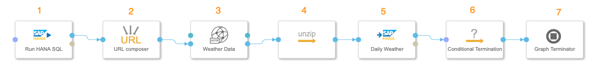.

It is a pipeline that creates steadily a data stream by sending URLs to the HTTP and the resulting data is finally send to the HANA DB. The data messages carries kind of message metadata and the actual data. In the metadata attributes there is variable that tells if this message is the last message that finally triggers the last operator to complete the pipeline. Without stopping actively a pipeline the process runs continously. 

**Please be noted,** 

that the configuration of this pipeline has not been adapted to the data sources connected with the Connection Management. The result of this pipeline has already been stored in the target database used in the following exercises. We have been told from SAP legal that getting data from public data sources in a workshop needs to be approved officially.  


## Exercise 1.2 Create New Pipeline for Advanced Processing

The previous 2 pipelines are generic in the sense that past weather data can be used for all kind of impact analysis. The next pipeline is rather specific. The SenDI company has devices scattered across Germany. For an analysis if the weather is somehow damaging the devices either the temperatures or the precipitation and which product type is more susceptible for weather conditions you need to get the weather data from the nearest weather station. That means that we have to choose for each device location from the weather station list the nearest one. Luckily the data scientist of SentDi could solve this challenge with a publicly available "next neighbour"-algorithm within an hour and provides a ready to use operator. All you need to do is collecting the data 

1. Weather Stations downloaded already to SAP Data Intelligence internal Data Lake: DI Data Lake
2. HANA Table of the device asset data: DEVICES

and sending the data to the "Next Neighbour"-Custom Operator. The result will be send to an additional HANA Table that stores the pair of device 'ID' and the nearest station 'ID'.

We provide the resulting pipeline for checking, nonetheless we strongly encourage you to run through the following steps of creating your own version. This hands-on might give you a better understanding how this 5th-generation programming actually works. 

In summary the steps needs to be done are

1. Create a new pipeline
2. Add the operators 
3. Connect the operators
4. Configure the operators
5. Run and validate the result of the pipeline

#### Create a new Pipeline
For adding a new pipeline ensure first that your focus is on the tab "Graphs" on the left panel and then click on the "plus"-button and a new plane white canvas opens. The focus as now changed already to "Operators"

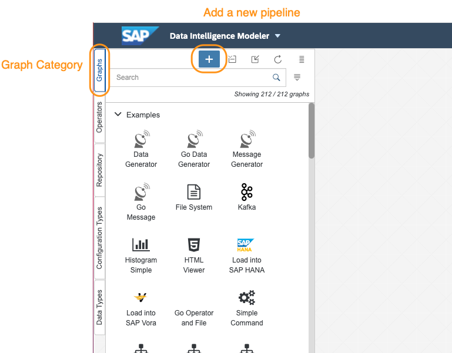

#### Add the Operators
Now you can add the processing modules or operators. There is a "search"-textfield on top of the left panel where you can type in the words for easily finding the operators. You can also first filter the operators by categories and then scan the operators. 

##### Read File
This operator reads files as a byte stream from an object store. There are other operators that can read structured data like csv-files and provide them in a table format. In this case, however, we need anyway a python-script and can include the byte-stream interpretation in the operator. 

For configuring open the "Configure"-panel by clicking on the top button on the left side of the "Read File"-operator. 


In the configuration panel you 

1. Change the "Read" value to "Once".
2. Edit the Connection (static) and 
	1. 	choose the "Connection type": Connection Management, then
	2. select in the new field "Connection ID": DI\_DATA\_LAKE and finally
	3. save the configuration
3. In "Path Mode" choose "Static (from configuration)"
4. In the "Path" select the path /shared and the file: dwdstations.csv. This file has been created in the first pipeline.


##### Read HANA Table

Add the "Read HANA Table" and open the "Configuration" panel of the operator as done with the "Read File"-operator. 

In the configuration panel you 

1. Edit the Connection (static) and 
	1. 	choose the "Connection type": Connection Management, then
	2. select in the new field "Connection ID": HANA\_DEVICES and finally
	3. save the configuration
2. In "Configuration Mode" select "Static (from configuration)". The dynamic option enables you to set the configuration via inport data. 
3. For the "Table name" enter: "DEVICES"
4. Edit the "Columns" and add three Collumns
	1. SERIAL_NO
	2. LATITUDE
	3. LONGITUDE.
	This step is necessary because this basic operator does not a pre-read of the data source during design time like the operators of the "Structured Data Operators" are doing. 
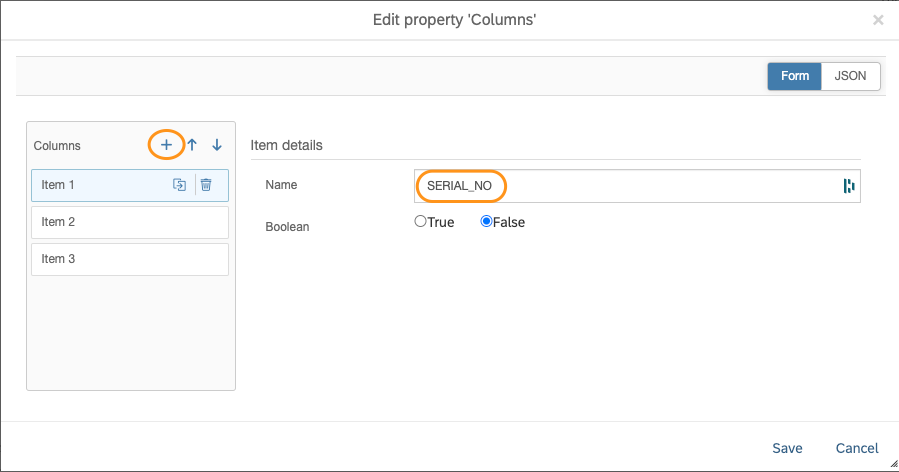

Remark: With the operators of the category "Structured Data Operator" it is much more convenient because it reads already the metadata from the data source. 

##### Next Neighbour

Add the custom operator "Next Neighbour" to the canvas and connect the outports of the "Read File" and "Read HANA Table" to the inports of the new operator. 

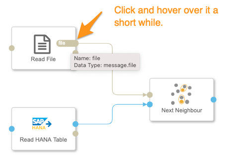

Ensure that you connect the right outports to the right inports. As you see the inport of the "Next Neighbour" operator has 2 different type of inports and you cannot connect ports of different data types. 

Configuration 
1. In "Dimension of Data" and "Dimensions of Network Nodes" both add 
	1. LONGITUDE
	2. LATITUDE in capital letters
2. "Suffix of Data Columns": \_DATA
3. "Suffix of Net Columns": \_NET 	

You can have a look at the codeing 
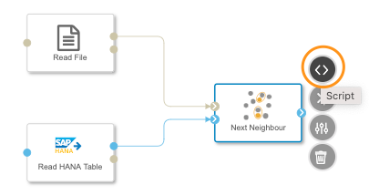

There you can see that there are special packages used for the next-neighbour algorithm: 

```
from scipy.spatial import KDTree
from geopy.distance import geodesic
```

These packages are not part of the standard Docker images and had to be created by extending an existing Docker image. This is not part of this tutorial and are normally provided by operations engineers. 

##### Write HANA Table

Finally the result needs to be written to the database. For this we are going to use the "Write HANA Table"-operator.

For the configuration we need to find the right 

* **Connection Type** - tenner digit
* **DB Schema** - roman tenner digit
* **table**  - user

for your specific user taXY.

The following table gives you the mapping:

| User Group | Connection | DB Schema | Table | 
| -----------| -----------| -----------| -----------|
| TA01 – TA10|DWC\_TechEd\_1|TECHED2021DAT160#TECHED2021DAT160|TECHED2021\_DEVICES\_WEATHERSTATION\_TAXY|
| TA11 – TA20|DWC\_TechEd\_2|TECHED2021DAT160II#TECHED2021DAT160II|TECHED2021\_DEVICES\_WEATHERSTATION\_TAXY|
| TA21 – TA30|DWC\_TechEd\_3|TECHED2021DAT160III#TECHED2021DAT160III|TECHED2021\_DEVICES\_WEATHERSTATION\_TAXY|
| TA31 – TA40|DWC\_TechEd\_4|TECHED2021DAT160IV#TECHED2021DAT160IV|TECHED2021\_DEVICES\_WEATHERSTATION\_TAXY|
| TA41 – TA50|DWC\_TechEd\_5|TECHED2021DAT160V#TECHED2021DAT160V|TECHED2021\_DEVICES\_WEATHERSTATION\_TAXY|
| TA51 – TA60|DWC\_TechEd\_6|TECHED2021DAT160VI#TECHED2021DAT160VI|TECHED2021\_DEVICES\_WEATHERSTATION\_TAXY|
| TA61 – TA70|DWC\_TechEd\_7|TECHED2021DAT160VII#TECHED2021DAT160VII|TECHED2021\_DEVICES\_WEATHERSTATION\_TAXY|

For cut and past and only changing you user:

```
“TECHED2021DAT160#TECHED2021DAT160”.”TECHED2021_DEVICES_WEATHERSTATION_TAXY”
“TECHED2021DAT160II#TECHED2021DAT160II”.”TECHED2021_DEVICES_WEATHERSTATION_TAXY”
TECHED2021DAT160III#TECHED2021DAT160III”.”TECHED2021_DEVICES_WEATHERSTATION_TAXY”
“TECHED2021DAT160IV#TECHED2021DAT160IV”.”TECHED2021_DEVICES_WEATHERSTATION_TAXY”
“TECHED2021DAT160V#TECHED2021DAT160V”.”TECHED2021_DEVICES_WEATHERSTATION_TAXY”
“TECHED2021DAT160VI#TECHED2021DAT160VI”.”TECHED2021_DEVICES_WEATHERSTATION_TAXY”
“TECHED2021DAT160VII#TECHED2021DAT160VII”.”TECHED2021_DEVICES_WEATHERSTATION_TAXY”
```


Configuration: 

1. Edit the Connection (static) and 
	1. 	choose the "Connection type": Connection Management, then
	2. select in the new field "Connection ID": <YOUR CONNECTION> and finally
	3. save the configuration
2. "Configuration Mode" select "Static (from configuration)"
3. "Table name": <YOUR SCHEMA>.<YOUR TABLE>
4. "Statement type": Upsert

The operator takes the metadata and the data from the incoming data and saves it to the corresponding table columns. 

##### Graph Terminator

The last operator is just completing the pipeline unconditionally. Once it gets data in the inport it stops regularly the process. 

#### Saving the Pipeline

The final pipeline will look like this: 

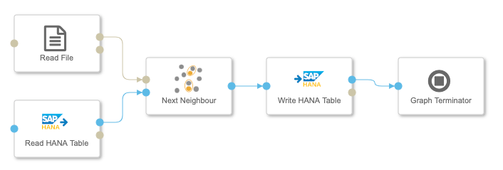

Before you can run the pipeline you have to save it. Because you are working in your own user workspace you are free to name. If the pipeline is intended to be used productively you rather name it according your guidelines. I strongly recommend to add each artifact (Operator or Pipeline) to a package be using a prefix separated with a dot, e.g. teched21.next_neighbour, or mycompany.weather.next_neighour. 

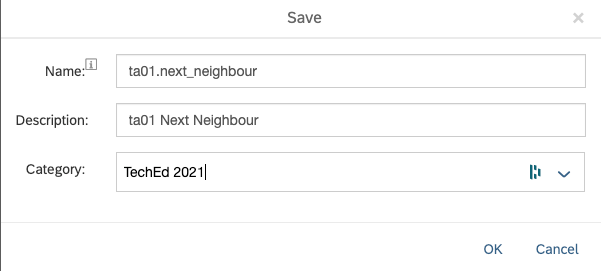

#### Run Pipeline

For running the pipeline you click on the "Run"-button at the top of the graph canvas. 
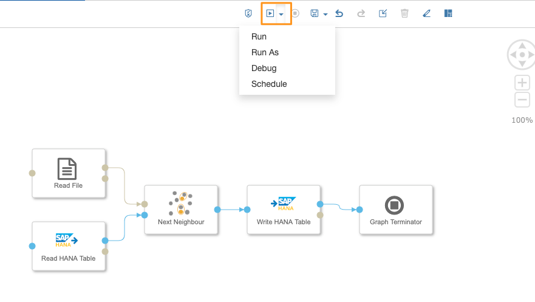

The SAP Data Intelligence cluster of this workshop might not have the capacity to run all pipelines at the same time in a timely manner. In case it takes too long we have entered the data already. 


## Summary

You've learnt how to build pipelines that can get external data of even "exotic" format and saves them to managed data sources. In addition you have seen that you can apply complex and public algorithms to enrich or transform data. 

Continue to - [Exercise 2 - Exercise 2 Description](../ex2/README.md)

