# Exercise 2 - Exercise 2 Description

In this exercise, we will utilize SAP Data Warehouse Cloud to create an analytical data model which can be consumed by SAP Analytics Cloud 

## Exercise 2.1 - Get started with SAP Data Warehouse Cloud

In [Exercise 1](../ex1/README.md) you have pushed a result set to SAP Data Warehouse Cloud using SAP Data Intelligence Cloud. Apart from that, there are also three existing tables in HANA Cloud that we want to use to build a consolidated table containing all the relevant information we need to derive insights going forward. Before starting off with modeling in SAP Data Warehouse Cloud we will logon to SAP Data Warehouse Cloud for the first time.

1. Logon to <a href="https://di-dwc-teched2021.eu10.hcs.cloud.sap/">SAP Data Warehouse Cloud </a>  
 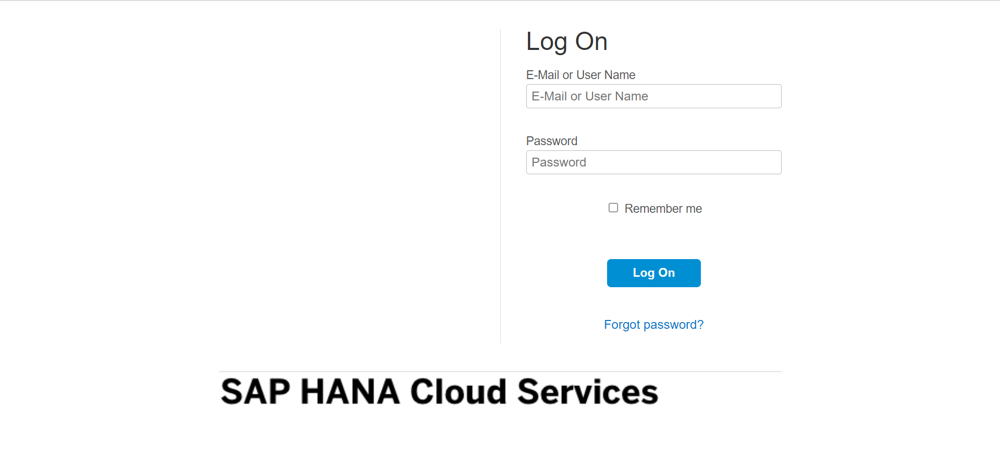
2. Specify the following information: 
     E-Mail or User Name: `christian.tietz+0XY@sap.com`  where XY is your assigned participant number
     Password: `Welcome01` 
    to get to the SAP Data Warehouse Cloud Home Screen. 

## Exercise 2.2 - Build a consolidated SAP Data Warehouse Cloud model 
   
3. Now, you should see the Home Screen of SAP Data Warehouse Cloud. Just click on the highlighted icon to get to your associated SAP Data Warehouse Cloud Space  
 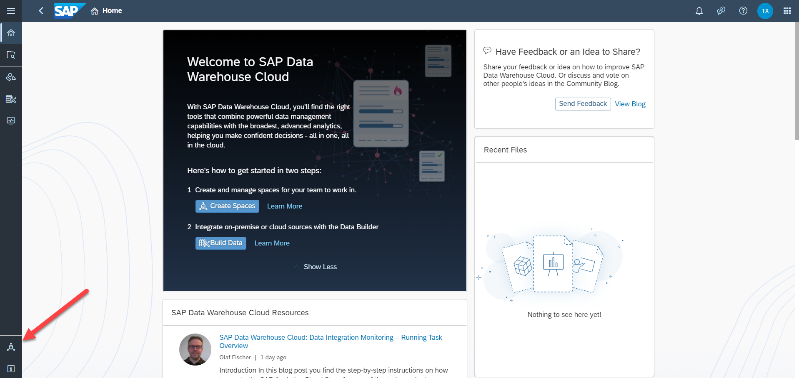 
4. Just click on your assigned space in the SAP Data Warehouse Cloud Space Management component  
 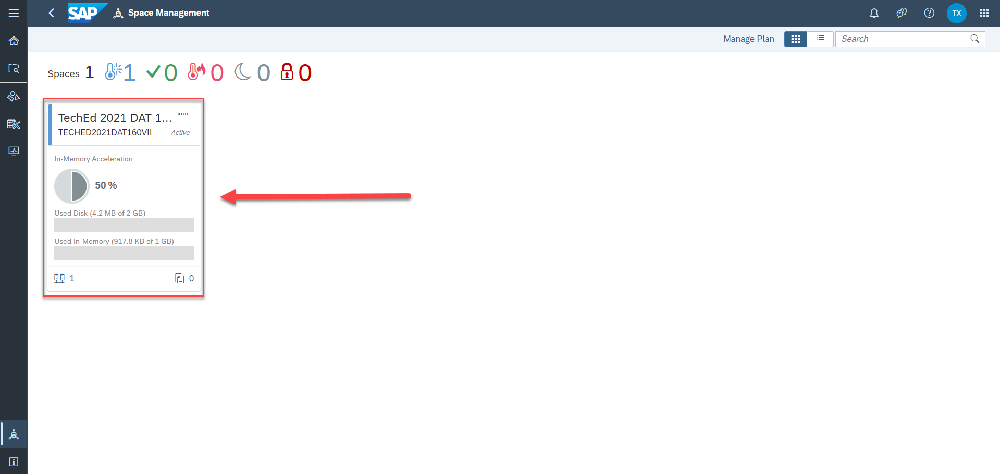 
5. Make yourself familiar with the different areas of your assigned SAP Data Warehouse Cloud space. Now, we choose to take a look at the `Connections` tab  
 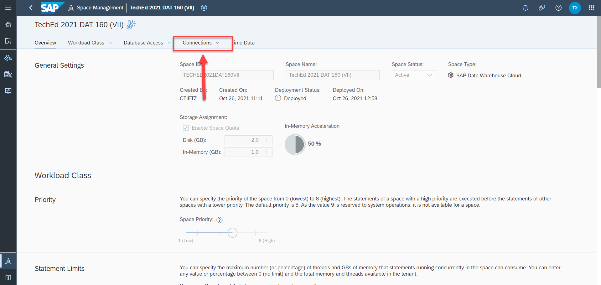 
6. You will realize that a local connection of type SAP HANA has already been created. As a next step, we will tick of this connection and validate it  
 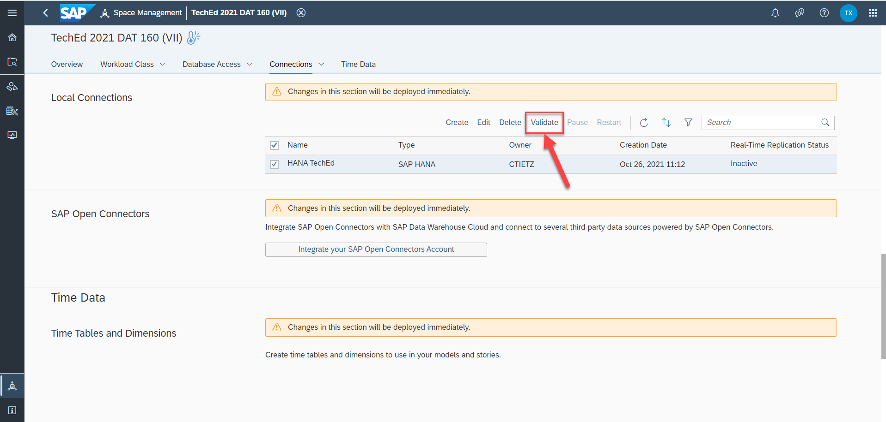 
7. We notice that the usage of Data Flows is enabled for this connection which is exactly what we need in what follows  
 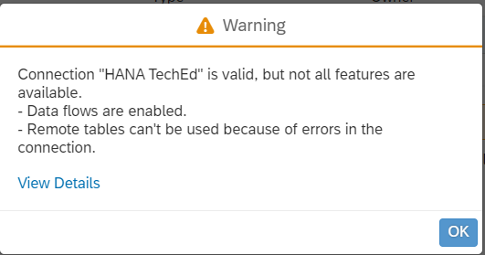 
8. As the next step we switch to the `Data Builder` component of SAP Data Warehouse Cloud  
 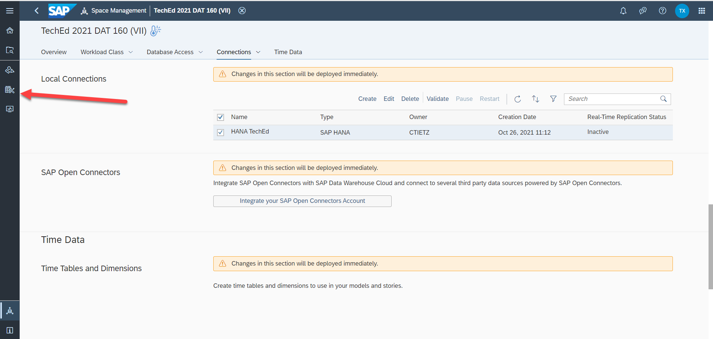 
9. We select the `Data Flow` component  
 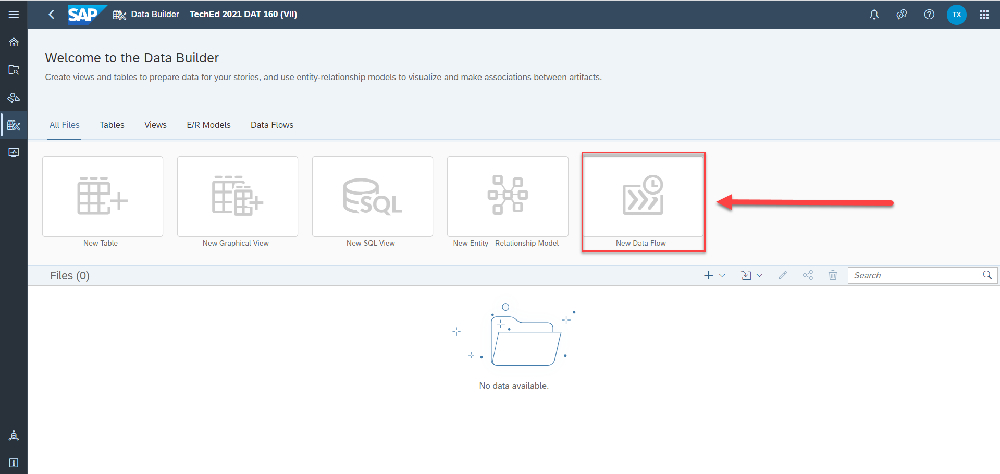 
10. Take a moment to familiarize yourself with the Data Flow environment in SAP Data Warehouse Cloud. Click on the `Sources` tab  
 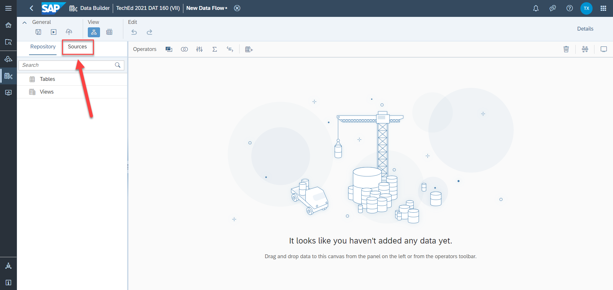 
11. Select the marked area in the Sources tab. This area is referring to your assigned HANA Cloud Database schema accessible from within your assigned SAP Data Warehouse Cloud space (cf. Step 4 from above) and is containing the content that is available to you  
 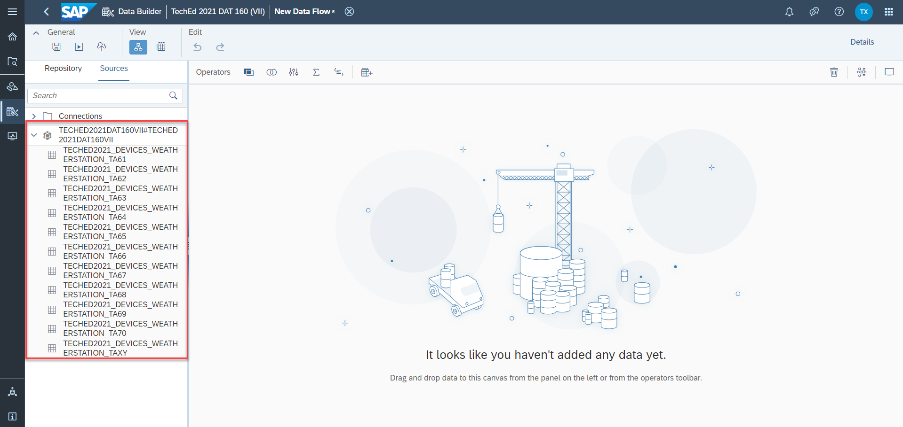 
12. Identify your associated table `TECHED2021_DEVICES_WEATHERSTATION_TAXY` where <b> XY refers to your assigned participant number</b>. Drag & drop it to the Data Flow canvas and select `Import and Deploy` to proceed. Note that you are now using the table that you have filled using SAP Data Intelligence (cf. [Exercise 1](../ex1/README.md)) 
 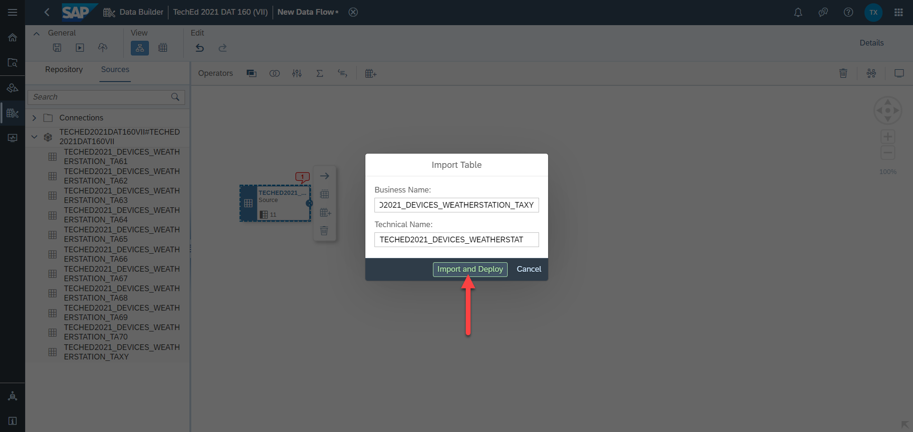 
13. Label the imported table as `Source`  
 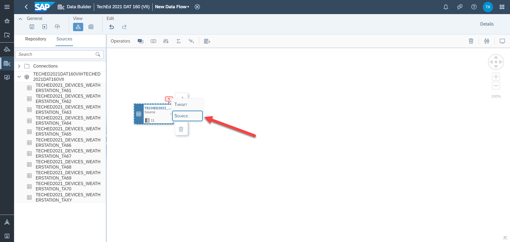 
14. At this point, we want to enrich the imported content with other tables containing information about the Daily Weather, about the Devices used as well as about the Services that have been taken place in the past. For this sake we make use of the pre-populated HANA Database connection called `HANA TechEd` in your assigned SAP Data Warehouse Cloud space (cf. Steps 6 and 7 from above). To do so, we click on the `Connections` tab in same area on the left hand side of the entire Data Flow screen 
 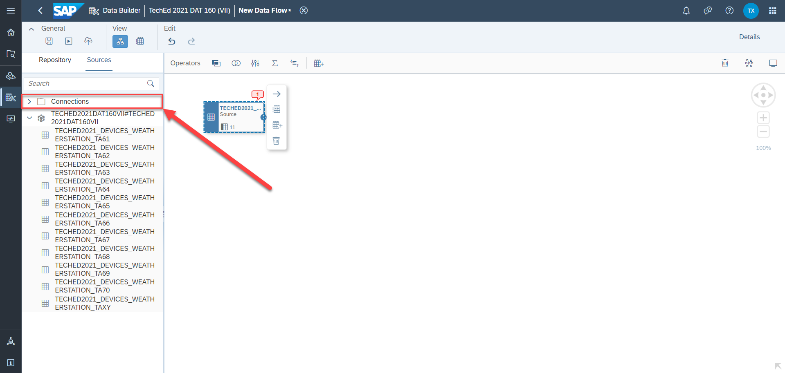 
15. Drag & drop the table `DAILY_WEATHER` to the Data Flow canvas 
 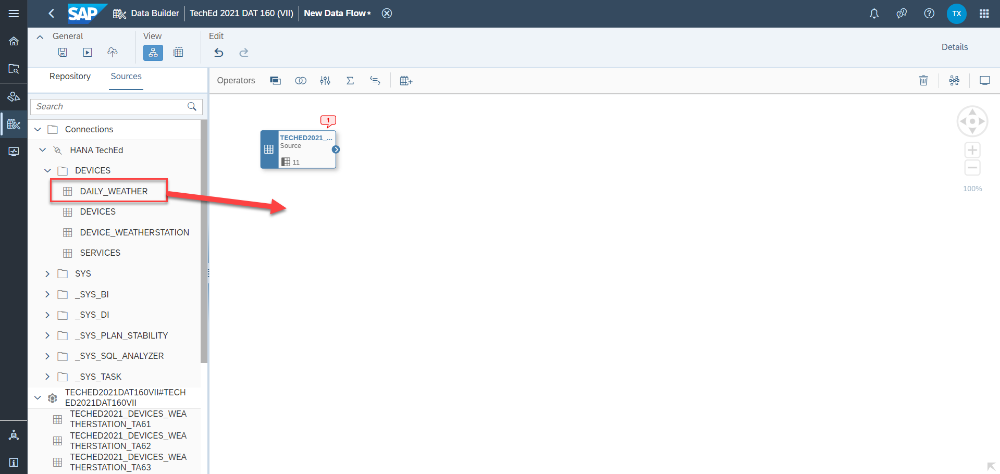 
16. Now, drag & drop the tables `DEVICES` and `SERVICES` to the Data Flow canvas 
 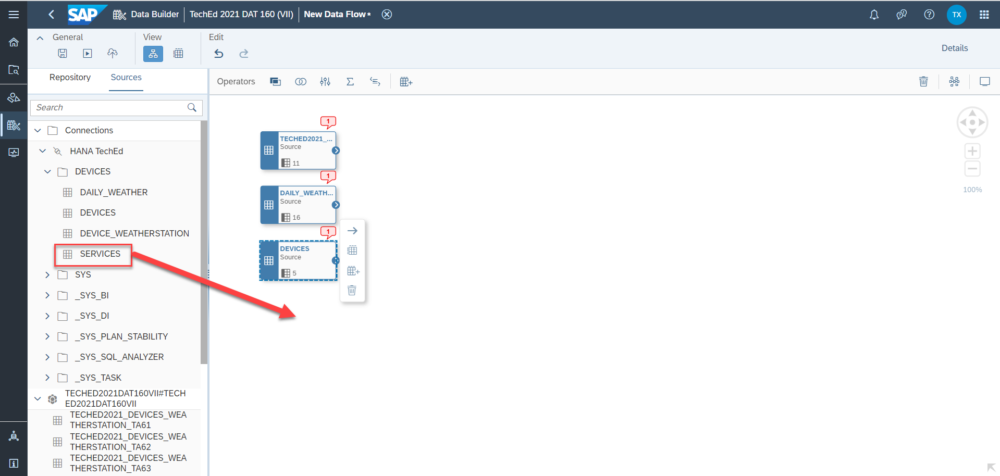 
17. As the next step, we will apply a projection on each of the four tables highlighted in the Data Flow canvas to get rid of some columns that we do not need for further processing. To do so, take a look at the `Operators` bar above the Data Flow canvas. We initially select the `Projection` operator and drag & drop it to the Data Flow canvas and right behind the first table from above, respectively  
 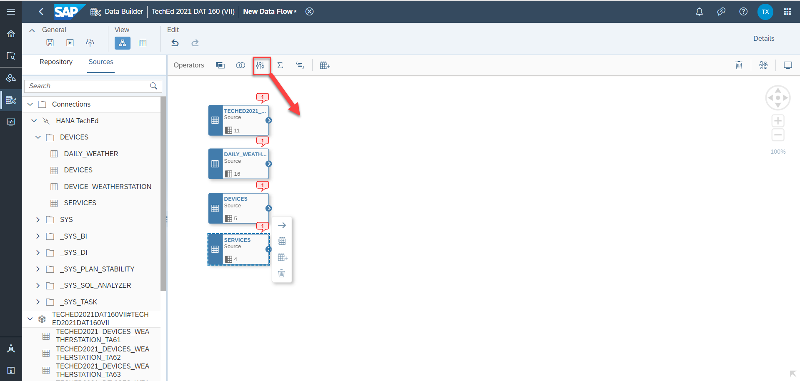 
18. We do realize that both the Table operator and the Projection operator do have ports that are exposed (cf. the area in the screenshot marked in red). Just hoover with your mouse over the output port of the Table operator and draw a line from this mentioned output port to the input port of the Projection operator to connect both 
 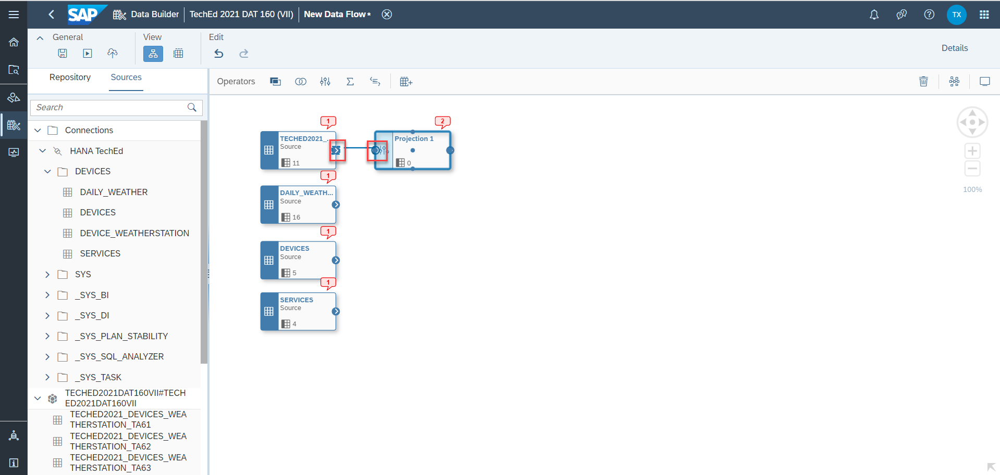 
19. Right now, just click on the Projection Operator named `Projection 1`. Then switch to the `Details` tab on the right hand side of the Data Flow screen. You will get to more detailed information about the columns, filter applied (if at all) and so on 
 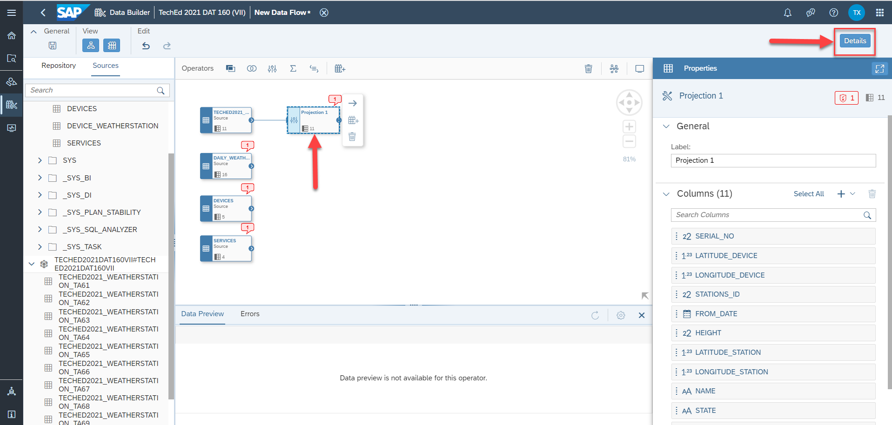 
20. Our goal is to remove columns that are not needed. We start off with the column `LATITUDE_DEVICE` that we would like to remove completely. To proceed with this, just click on the three dots on the right hand side when selecting the mentioned column  
 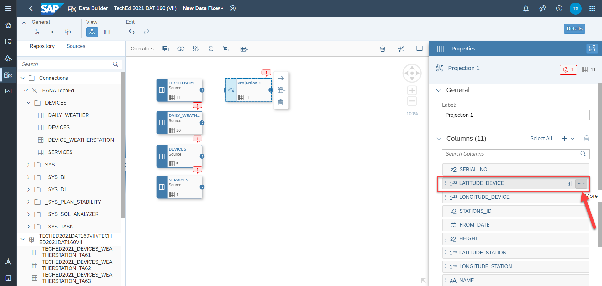 
21. Once you have done that there are three options you can choose in principle. We select the option `Remove Column` 
 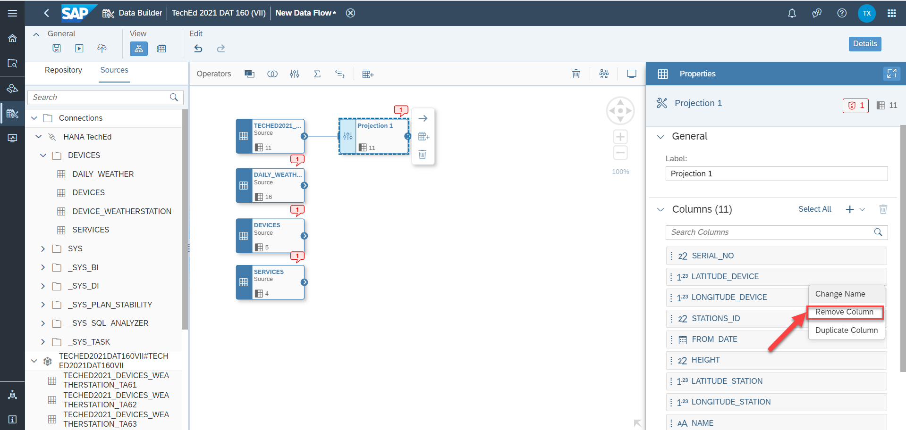 
22. Now we do proceed exactly as described in the aforementioned steps 20 and 21 and remove the following columns from the `Projection 1` Operator: 
- `LONGITUDE_DEVICE`  
- `HEIGHT`  
- `LATITUDE_STATION`  
- `LONGITUDE_STATION`  
- `DISTANCE`  
You will end up with having five columns remaining as output in the Projection 1 Operator 
 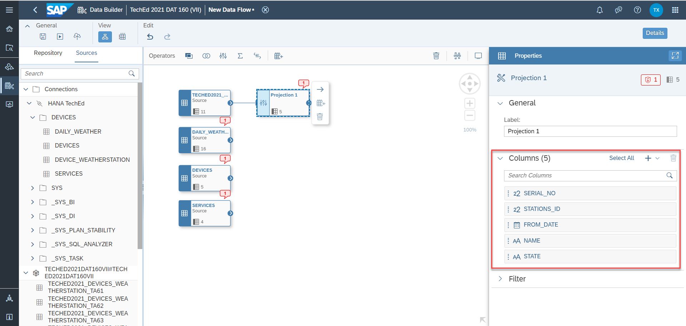 
23. 
## Summary

You've now ...

Continue to - [Exercise 3 - Excercise 3 ](../ex3/README.md)
