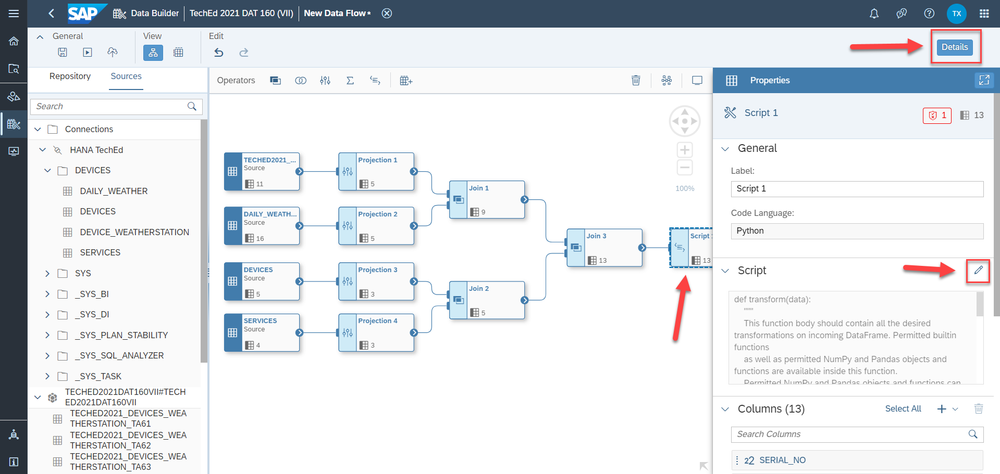
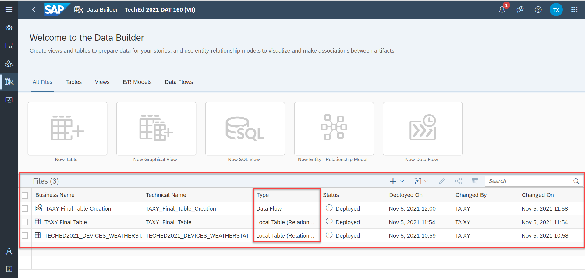

# Exercise 2 - Utilize SAP Data Warehouse Cloud

In this exercise, we will utilize SAP Data Warehouse Cloud to integrate different data streams. To do this we use the Data Flow Builder provided.

## Exercise 2.1 - Get started with SAP Data Warehouse Cloud

In [Exercise 1](../ex1/README.md) you have pushed a result set to SAP Data Warehouse Cloud using SAP Data Intelligence Cloud. Apart from that, there are also three existing tables in HANA Cloud that we want to use to build a consolidated table containing all the relevant information we need to derive insights going forward. Before starting off with modeling in SAP Data Warehouse Cloud we will logon to SAP Data Warehouse Cloud for the first time.

1. Logon to <a href="https://di-dwc-teched2021.eu10.hcs.cloud.sap/">SAP Data Warehouse Cloud </a>  
 
2. Specify the following information: 
     E-Mail or User Name: `christian.tietz+0XY@sap.com`  where XY is your assigned participant number
     Password: `Welcome01` 
    to get to the SAP Data Warehouse Cloud Home Screen. 

## Exercise 2.2 - Integrate different Data Streams via building a comprehensive Data Flow in SAP Data Warehouse Cloud 
   
3. Now, you should see the Home Screen of SAP Data Warehouse Cloud. Just click on the highlighted icon to get to your associated SAP Data Warehouse Cloud Space  
  
4. Just click on your assigned space in the SAP Data Warehouse Cloud Space Management component  
  
5. Make yourself familiar with the different areas of your assigned SAP Data Warehouse Cloud space. Now, we choose to take a look at the `Connections` tab  
  
6. You will realize that a local connection of type SAP HANA has already been created. As a next step, we will tick of this connection and validate it  
  
7. We notice that the usage of Data Flows is enabled for this connection which is exactly what we need in what follows  
  
8. As the next step we switch to the `Data Builder` component of SAP Data Warehouse Cloud  
  
9. We select the `Data Flow` component  
  
10. Take a moment to familiarize yourself with the Data Flow environment in SAP Data Warehouse Cloud. Click on the `Sources` tab  
  
11. Select the marked area in the Sources tab. This area is referring to your assigned HANA Cloud Database schema accessible from within your assigned SAP Data Warehouse Cloud space (cf. Step 4 from above) and is containing the content that is available to you  
  
12. Identify your associated table `TECHED2021_DEVICES_WEATHERSTATION_TAXY` where <b> XY refers to your assigned participant number</b>. Drag & drop it to the Data Flow canvas and select `Import and Deploy` to proceed. Note that you are now using the table that you have filled using SAP Data Intelligence (cf. [Exercise 1](../ex1/README.md)) 
  
13. Label the imported table as `Source`  
  
14. At this point, we want to enrich the imported content with other tables containing information about the Daily Weather, about the Devices used as well as about the Services that have been taken place in the past. For this sake we make use of the pre-populated HANA Database connection called `HANA TechEd` in your assigned SAP Data Warehouse Cloud space (cf. Steps 6 and 7 from above). To do so, we click on the `Connections` tab in same area on the left hand side of the entire Data Flow screen 
  
15. Drag & drop the table `DAILY_WEATHER` to the Data Flow canvas 
  
16. Now, drag & drop the tables `DEVICES` and `SERVICES` to the Data Flow canvas 
  
17. As the next step, we will apply a projection on each of the four tables highlighted in the Data Flow canvas to get rid of some columns that we do not need for further processing. To do so, take a look at the `Operators` bar above the Data Flow canvas. We initially select the `Projection` operator and drag & drop it to the Data Flow canvas and right behind the first table from above, respectively  
  
18. We do realize that both the Table operator and the Projection operator do have ports that are exposed (cf. the area in the screenshot marked in red). Just hoover with your mouse over the output port of the Table operator and draw a line from this mentioned output port to the input port of the Projection operator to connect both 
  
19. Right now, just click on the Projection Operator named `Projection 1`. Then switch to the `Details` tab on the right hand side of the Data Flow screen. You will get to more detailed information about the columns, filter applied (if at all) and so on 
  
20. Our goal is to remove columns that are not needed. We start off with the column `LATITUDE_DEVICE` that we would like to remove completely. To proceed with this, just click on the three dots on the right hand side when selecting the mentioned column  
  
21. Once you have done that there are three options you can choose in principle. We select the option `Remove Column` 
  
22. Now we do proceed exactly as described in the aforementioned steps 20 and 21 and remove the following columns from the `Projection 1` Operator:  
- `LONGITUDE_DEVICE`  
- `HEIGHT`  
- `LATITUDE_STATION`  
- `LONGITUDE_STATION`  
- `DISTANCE`  
You will end up with having five columns remaining as output in the Projection 1 Operator 
  
23. At this stage we proceed with applying a projection on the second table `DAILY_WEATHER`. For this purpose we do essentially repeat the steps 17 to 22 from above. Precisely we remove the following columns as output from the `Projection 2` Operator: 
- `MAX_WINDGUST`  
- `MEAN_WIND_VELOCITY`  
- `SNOW_DEPTH`  
- `CLOUD_COVER`  
- `VAPOR_PRESSURE`  
- `MEAN_PRESSURE`  
- `MEAN_TEMPERATURE`  
- `MEAN_REL_HUMIDITY`  
- `MAX_TEMPERATURE`  
- `MIN_TEMPERATURE`  
- `MIN_AIR_TEMPERATURE`  
You will end up with having five columns remaining as output in the Projection 2 Operator 
  
24. Moreover, we also apply a projection on the third table `DEVICES`. For this purpose we do essentially repeat the steps 17 to 22 from above. Precisely we remove the two columns `LATITUDE` and `LONGITUDE` as output from the `Projection 3` Operator. As a result, the following output then remains: 
  
25. Last but not least, we finally apply a projection on the fourth table `SERVICES`. After having repeated all the steps 17 to 22 from above and removing the column `SERVICE_DATE` the output of the highlighted `Projection 4` Operator will look as follows: 
  
26. Just to recall what we want to do, our goal is to create a <b> consolidated </b> output containing information originating from all four tables that are part of the Data Flow as of now. Hence, as the next step we want to initially apply an `Inner Join` on both the two tables `TECHED2021_DEVICES_WEATHERSTATION_TAXY` (XY refers to your participant number) and `DAILY_WEATHER` as well as on the two tables `DEVICES` and `SERVICES`.   For this sake we drag & drop the `Join` Operator from the `Operators` bar to the Data Flow canvas twice 
  
27. As depicted in step 18, let us connect the respective output ports of the tables with the associated input ports of the Join Operators. Next, we click on the first Join Operator called `Join 1` and take a look at the details by selecting the `Details` tab  
  
28. Let us click the pencil button to proceed to the join details 
  
29. We do realize that we are going to apply an `Inner Join` condition on the column `STATIONS_ID`. By selecting the `Details` tab at the upper right of the screen we go back to the original Data Flow screen 
  
30. Let us repeat the steps for the `Join 2` Operator. We see that we are going to apply an `Inner Join` condition on the column `SERIAL_NO`. By selecting the `Details` tab at the upper right of the screen we go back to the original Data Flow screen  
  
31. As the next step, we once again drag & drop the `Join` Operator from the `Operators` bar to the Data Flow canvas to finally join the outputs of both join operations that have been applied in the previous steps. As before we do connect the respective output ports and input ports accordingly and take a look at the details of the join operation to be done 
  
32. Taking a look at the details of the `Join 3` Operator we can state that we are going to apply an `Inner Join` condition on the column `SERIAL_NO`. By selecting the `Details` tab at the upper right of the screen we go back to the original Data Flow screen  
  
33. In order to avoid potential duplicates that could occur during the join operations that have been applied previously we make use of the `Script` Operator provided with the Data Flow component. The Script Operator itself allows to include basic Python Coding to apply transformations on incoming structured datasets. In return it provides structured output as well 
  
34. We now connect the output port of the `Join 3` Operator with the associated input port of the `Script 1` Operator. Subsequently, we select the `Script 1` Operator located in the Data Flow canvas and take a look at its details. We click on the pencil icon to switch to the inbuilt Script editor 
  
35. As stated in Step 33 we want to remove duplicate records that might occur. For this purpose we just include one line of simple Python coding leveraging the open source data analysis and manipulation tool `pandas`.   Precisely, we do incorporate coding `data=data.drop_duplicates()` in the function body highlighted in the Script Editor. Now, let us get back to the Data Flow canvas by selecting the Details tab at the upper right of the screen   
  
36. At this stage we have almost accomplished the creation of our entire Data Flow. The only thing which is yet missing is to create a target table in SAP Data Warehouse Cloud which acts as a consolidated result set that is generated when executing the Data Flow at hand 
To proceed with that we drag & drop the `Table` Operator from the `Operators` tab to the Data Flow canvas. Make sure that the table is labeled as `Target` 
  
37. Connect the output port of the `Script 1` Operator with the input port `Table` Operator. Now, we select the `Table` Operator and take a look at its details and properties, respectively. We rename the `Table` Operator as highlighted in the screenshot below. Please note that XY refers to your participant number as always. Last but not least, we finally select the option `Create and Deploy Table`. This is very important as it creates the runtime artefact being used once we execute the present Data Flow to persist the result set in SAP Data Warehouse Cloud 
  
38. As a consequence, an information note will appear on your screen. We confirm that we want to create and deploy the target table 
  
39. Scrolling down further in the `Properties` area of the target table that has now been created and deployed we finally select the `Mode` tab and choose the option `Truncate` in the drop down menu at hand 
  
40. Congratulations! The Data Flow has been built! At this point we merely want to execute it. For this sake we select the `Save` button at the upper left of the screen and rename the Data Flow as highlighted in the screenshot below. Please make sure that you replace XY by your assigned participant number. Click `Save` to continue  
  
41. In order to finally execute the Data Flow we make use of the `Execute` button which can be found at the upper left of the screen as well 
  
42. Once you have chosen to execute the Data Flow, the status is highlighted as `Running`. We want to take a look at further details with respect to the Data Flow execution itself. For this purpose we move forward to the `Data Integration Monitor` component of SAP Data Warehouse Cloud 
  
43. You will be directed to another screen which is detailing out the `Run Details` of the running Data Flow. The messages do describe the current actions that are taken by the Data Flow execution. You can refresh the status accordingly 
  
44. After a couple of minutes, the status of the Data Flow execution should switch to `Completed`. Now, we go back to the `Data Builder` application of SAP Data Warehouse Cloud 
  
45. In the `Data Builder` application of SAP Data Warehouse Cloud you will realize that new artefacts have been generated. To become more precise, you have created two local (relational) tables as a result of the deployments you have triggered in the steps 12 and 38 from above. Apart from this and as a result of the steps 40 and 41, respectively, you have saved and executed a Data Flow object which was the main goal of this exercise  
  

## Summary

Congratulations! You have built and executed your first Data Flow in SAP Data Warehouse Cloud! We hope you enjoyed it!  
To briefly recap what we did in Exercise 2, we have created a quite comprehensive Data Flow in SAP Data Warehouse Cloud that has integrated different data streams and produced a single, consolidated output table. This will be taken as a basis for building an analytical view in SAP Data Warehouse Cloud which can be utilized for consumption in SAP Analytics Cloud. In SAP Analytics Cloud, we can make use of the strong Business Intelligence capabilities to start off with some Data Exploration to gain some insights in the data we have gathered and harmonized accordingly.

Please continue to do [Exercise 3](../ex3/README.md)
